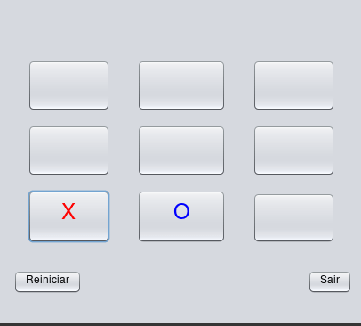

# Jogo da Velha em Java


Um clássico Jogo da Velha implementado em Java com interface gráfica usando Swing, oferecendo dois modos de jogo: contra outro jogador ou contra a máquina.

 

## 🎮 Funcionalidades

- **Dois modos de jogo**:
  - Jogador vs Jogador
  - Jogador vs Máquina (com IA básica)
- **Interface intuitiva**:
  - Tabuleiro colorido com feedback visual
  - Indicação clara do vencedor/empate
- **Recursos avançados**:
  - Reinício rápido do jogo
  - Sistema de controle de turnos
  - Detecção automática de vitória/empate

## 🚀 Como Executar

### Pré-requisitos
- Java JDK 11 ou superior
- Maven (opcional)

### Passo a Passo
1. Clone o repositório:
```bash
git clone https://github.com/JP-Linux/jogo-da-velha-java.git
cd jogo-da-velha-java
```

2. Compile e execute:
```bash
# Com Maven
mvn clean package
java -jar target/jogo-da-velha.jar

# Sem Maven
javac src/main/java/com/jotta/jogodavelha/*.java
java -cp src/main/java com.jotta.jogodavelha.JogoDaVelha
```

## 🧩 Estrutura do Projeto

```
src/main/java/com/jotta/jogodavelha/
├── Base.java          - Lógica do tabuleiro e regras do jogo
├── Intermediario.java - Gerenciamento de estado do jogo
├── JogoDaVelha.java   - Interface gráfica principal
└── Main.java          - Ponto de entrada da aplicação
```

## 🧠 Design e Arquitetura

O projeto segue uma arquitetura em camadas com separação clara de responsabilidades:

1. **Camada de Apresentação** (Swing):
   - `JogoDaVelha.java`: Interface gráfica e interação do usuário

2. **Camada de Controle**:
   - `Intermediario.java`: Gerencia regras de negócio e estado do jogo

3. **Camada de Modelo**:
   - `Base.java`: Representa o tabuleiro e lógica de vitória/empate

## ✨ Recursos Técnicos

- **Padrões de Projeto**:
  - MVC (Model-View-Controller) implícito
  - Singleton para gerenciamento de estado
- **Otimizações**:
  - Algoritmo eficiente de verificação de vitória (O(1))
  - IA com seleção aleatória otimizada
- **Boas Práticas**:
  - Tratamento de exceções
  - Código modularizado
  - Nomenclatura consistente

## 👤 Autor

**Jorge Paulo Santos**  
[](https://github.com/JP-Linux)
[](mailto:jorgepsan7@gmail.com)

## 📄 Licença

Este projeto está licenciado sob a Licença MIT - veja o arquivo [LICENSE](LICENSE) para detalhes.